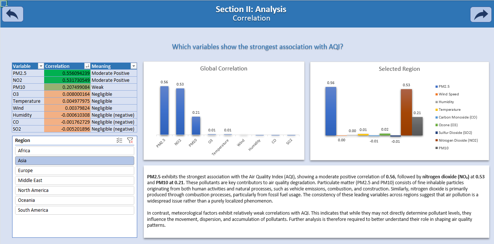
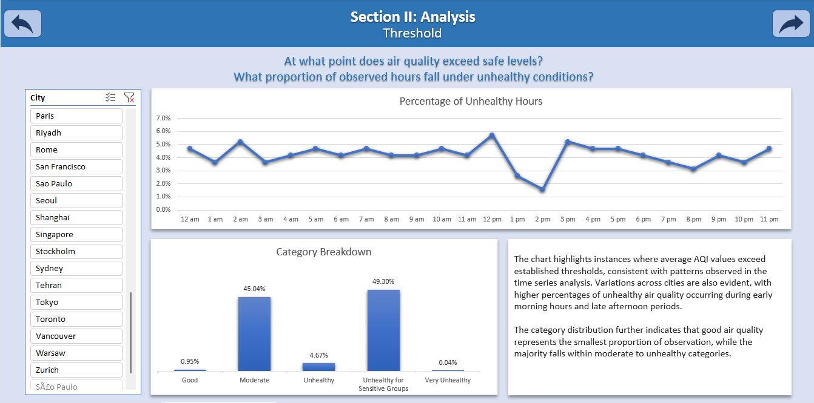
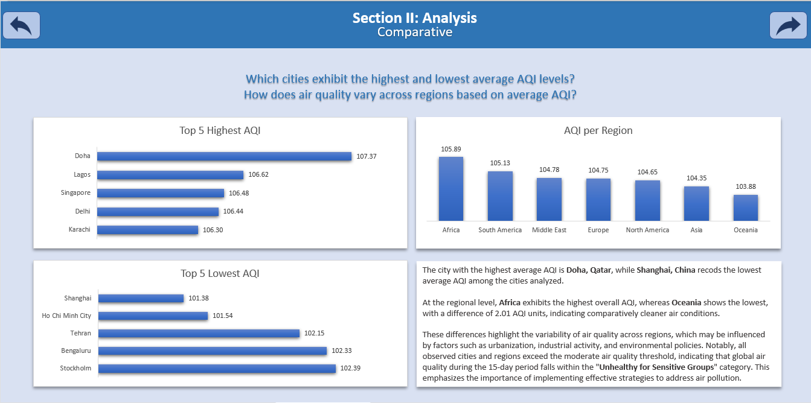
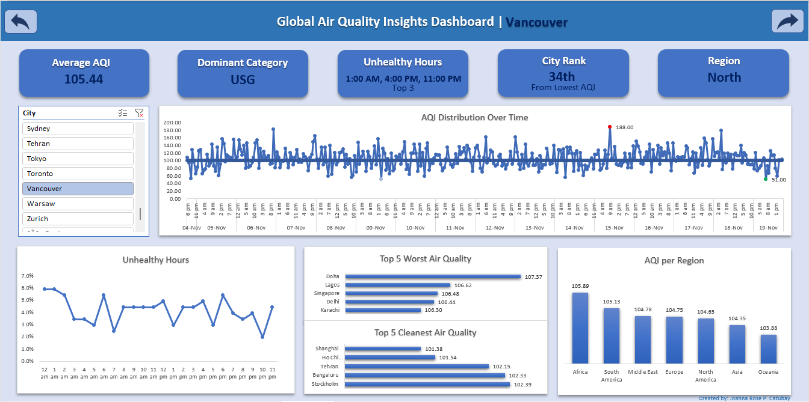

# Environmental-Analysis-of-Global-Air-Quality-Data
Excel-based analysis of hourly air quality data across 50 global cities over a 15-day monitoring period.

## Project Overview
This project presents an insightful analysis on air quality data from 50 major global cities on a 15-day monitoring 
period. It uses Excel tools and functions to analyze the data behavior and correlations to existing variables. It 
comprises multiple analysis processes to derive information and create a unified air quality dashboard.

## Objectives
1. Conduct multiple analysis processes on global air quality data.
2. Develop an interactive and informative dashboard.
3. Generate insights and conclusions based on observed patterns and relationships.

## Dataset Description
The dataset was sourced from Kaggle; it comprises 18000 datapoints all from 50 major cities from regions Africa, North 
America, South America, Asia, Europe, Oceania, and Middle East. It encapsulates an hourly 15-day monitoring period of 
the AQI (Air Quality Index) and its pollutant variables, PM2.5, PM10, NO2, SO2, O3, and CO as well as its accompanying 
meteorological factors, temperature, humidity, and wind speed.

## Analysis Process
This project conducted these following analyses:
1. **Data Exploration**. It presents surface level analysis on all the average AQI and cities’ maximum and minimum air
   quality readings.
2. **Time Series Analysis**. It shows the air quality distribution behavior revealing significant fluctuations over the
   entire monitoring period
3. **Threshold Analysis**. This is a continuation of the time series analysis focusing on the reading which exceeded the
   threshold. This analysis also presents the category breakdown across different cities.
4. **Correlation Analysis**. This section visualizes the variables most correlated with the AQI readings. 
5. **Variable Behavior Analysis**. This analysis focuses on taking a deeper look on the variables least associated with
   AQI which are the meteorological factors. It displays the variable behavior along the AQI each with normalized
   datapoints, scaling the values to observe correlation in the graph.
6. **Comparative Analysis**. This phase displays the cities with the worst and cleanest air quality as well as the regional
    perspective of air quality readings.

## Key Analysis Highlights
### **Correlation Analysis**

### **Threshold Analysis**

### **Comparative Analysis**

## Key Insights
- Most cities fell under the “Unhealthy for Sensitive Groups” classification.
- Good air quality has the smallest percentage among all the categories.
- PM2.5, Nitrogen Dioxide, and PM10 are the variables most correlated with the air quality index reading.
- Meteorological factors can influence how pollutants behave and spread.
- Air quality is not just a localized issue but a global concern.

## Dashboard Preview

## Tools Used
1. Excel Functions and Formulas
2. Pivot Tables, Pivot Charts, Slicers, and Conditional Formatting
3. Data Visualization Tools
4. Links

## Personal Reflection
This project strengthened my interest in environmental monitoring and helped me understand how data reflects 
real-world environmental conditions. It allowed me to connect analysis with meaningful real-life applications.

## Future Improvements
- Use real-world datasets.
- Apply machine learning for AQI predictions.
- Expand analysis over longer time periods.

## Files Included
1. For full access to Project 2, please download the provided file to view analyses and final dashboard output.
2. For optimal viewing, please set your screen to full-screen mode.
- 
  
## Data Source
- Dataset Title: Global Air Quality Data(15 Days Hourly, 50 Cities)
- Website: Kaggle
- Author: Smeet Raichura
- Source Link: https://www.kaggle.com/datasets/smeet888/global-air-quality-data15-days-hourly-50-cities
- License: CC0: Public Domain
